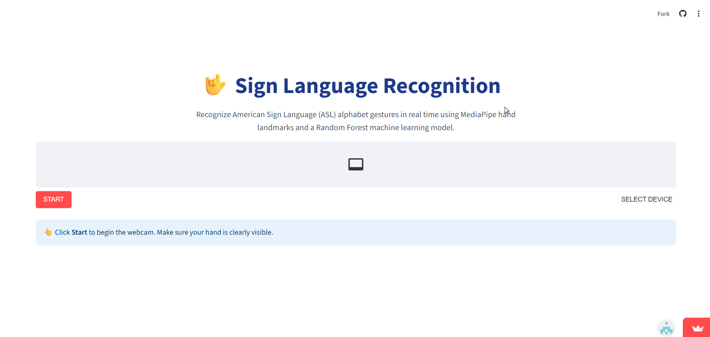
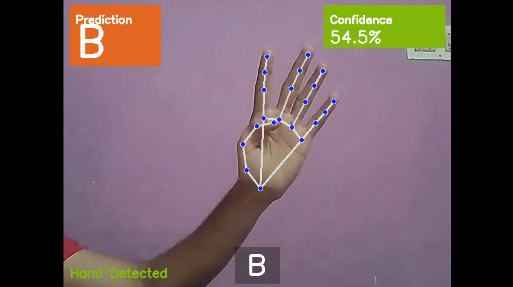
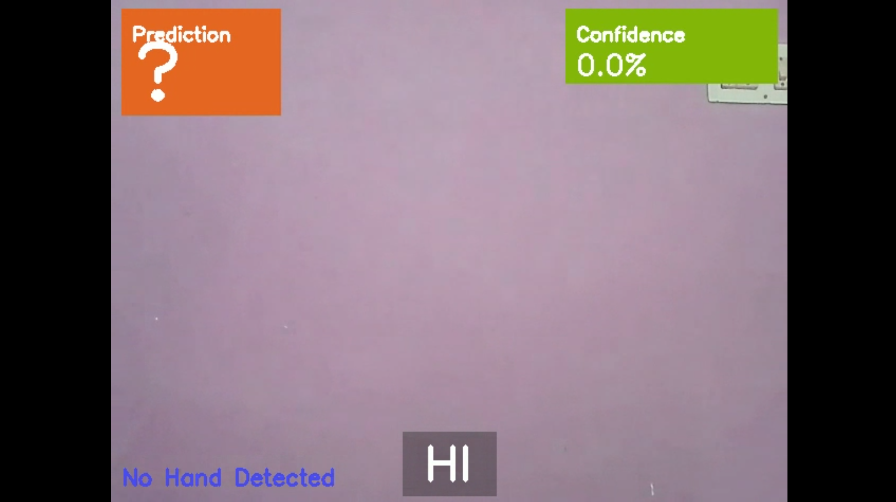

# 🤟 Sign Language Recognition using MediaPipe & Random Forest

A real-time American Sign Language (ASL) alphabet recognition system built using **MediaPipe**, **Random Forest**, **OpenCV**, and **Streamlit**. The application detects hand landmarks from a webcam feed and predicts ASL alphabet gestures in real time while allowing users to build words interactively.

---

## 🚀 Live Demo

🌐 **Streamlit App**

https://sign-language-recognition-version1.streamlit.app/

---

## 🎥 Demo Video

▶️ Watch the complete project demonstration here:

https://drive.google.com/file/d/1CIfvCqkTBoVWGJuz7J8rJSHUccYhfNu_/view?usp=drive_link

---

## 📌 Features

- ✅ Real-time webcam-based sign language recognition
- ✅ MediaPipe hand landmark detection
- ✅ Random Forest machine learning model
- ✅ Predicts ASL alphabet gestures
- ✅ Live confidence score
- ✅ Word builder
- ✅ Space gesture support
- ✅ Delete gesture support
- ✅ Stable prediction filtering
- ✅ Clean Streamlit interface
- ✅ Deployable on Streamlit Community Cloud

---

## 🛠 Tech Stack

- Python
- Streamlit
- MediaPipe
- OpenCV
- Scikit-learn
- Random Forest Classifier
- NumPy
- Joblib

---

## 📂 Project Structure

```text
Sign-Language-Recognition/
│
├── app.py
├── requirements.txt
├── README.md
├── LICENSE
├── .gitignore
│
├── models/
│   └── sign_model.pkl
│
├── src/
│   ├── extract_landmarks.py
│   ├── train_model.py
│   └── predict_webcam.py
│
├── screenshots/
│   ├── home.png
│   ├── letter_prediction.png
│   └── word_builder.png
│
└── data/
```

---

## ⚙️ How It Works

1. Webcam captures live frames.
2. MediaPipe extracts **21 hand landmarks**.
3. Landmark coordinates are converted into feature vectors.
4. Random Forest predicts the corresponding ASL letter.
5. Stable predictions are added to the word builder.
6. Special gestures allow adding spaces and deleting characters.

---

## 📸 Screenshots

### 🏠 Home Screen



---

### ✋ Letter Prediction



---

### 📝 Word Builder



---

## 📦 Installation

Clone the repository

```bash
git clone https://github.com/JAIKRISHNA2007/Sign-Language-Recognition.git
```

Move into the project

```bash
cd Sign-Language-Recognition
```

Install dependencies

```bash
pip install -r requirements.txt
```

Run the application

```bash
streamlit run app.py
```

---

## 📊 Machine Learning Pipeline

Dataset

↓

MediaPipe

↓

21 Hand Landmarks

↓

63 Numerical Features

↓

Random Forest Model

↓

Real-time Prediction

↓

Word Builder

---

## 📁 Model

The trained model is hosted separately because GitHub has file size limitations.

Model Download:

https://drive.google.com/drive/folders/1rnF8viszOJfsc73_ETXkF1SqFgCkrDZz?usp=drive_link

---

## 🔮 Future Improvements (Version 2)

- Sentence formation
- Deep Learning (LSTM/Transformer)
- More ASL signs
- Dynamic gesture recognition
- Speech output
- Text-to-Speech
- Translation support
- Improved UI/UX
- Better confidence estimation
- Higher accuracy with larger datasets

---

## 📄 License

This project is licensed under the **MIT License**.

---

## 👨‍💻 Author

**JAI KRISHNA S**

Computer Science Engineering Student

---

## 🏢 Internship Information

**CodTech AI Internship**

**Project:** Sign Language Recognition using Machine Learning

**Intern ID:** CTTS162

---

⭐ If you found this project useful, consider giving it a star on GitHub!